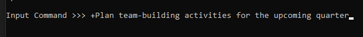

# Assembly_ToDo_List - Amir Gorkovchenko (Fall 2024)

Simple command line todo list application programed in x86 assembly using MASM.

No external Libraries required. Relies on Windows API

Has the ability to open saved todo Lists from files.

Implements a linked list in assembly to hold items.

## Usage
Enter a command followed by an operand, like a string or index (+, -, ?, * or !)
 - <+> Add Chores (eg. +item or +3item)
 - <-> Delete Chores (eg. -3 or -item)
 - <\?> View List
 - <*> Open New List (eg. * or *new list)
 - <!> Save and Exit

The application starts up opening the default list, named "list"

Multiple lists can be stored throughout the use of the program, each one will be saved to a file in the root directory.

### Files <\*>
Different lists and their names can be discovered and listed using the <\*> command alone.
They can then be opened using the <\*> command immediately followed by the list name.
The current working list will always be saved before opening the new list.
The new list will be immediately displayed with its contents. If a new list name has bee inputted, a new empty list will be created.

Using the <\?> command alone, the current working list will be displayed along with its name.

### Adding <+>
New items can be added using the <+> command with the item following it immediately:

An index can be given before the item to add it in a specific location:

The application will imediatly follow with the result of the command and an updated list above:

### Removing <->
There are two methods that an item can be removed using the <-> command.

A <-> followed immediately with a string will attempt to match any items with that string and will remove them all:

A specific item can be removed using an index immediately after the <-> command:

### Save and Exit <!>
Each list is automatically saved when switching out lists but the last list can be saved using the <!> command which will also exit the application.

### Help
To bring up the instructions on screen once again, enter the word "help."\
Caps ignored

## Design
Each list is held by a linked list with ability to insert, remove and swap items with ease.

Each list is carefully packaged into a binary file with the *.todo.bin extension.